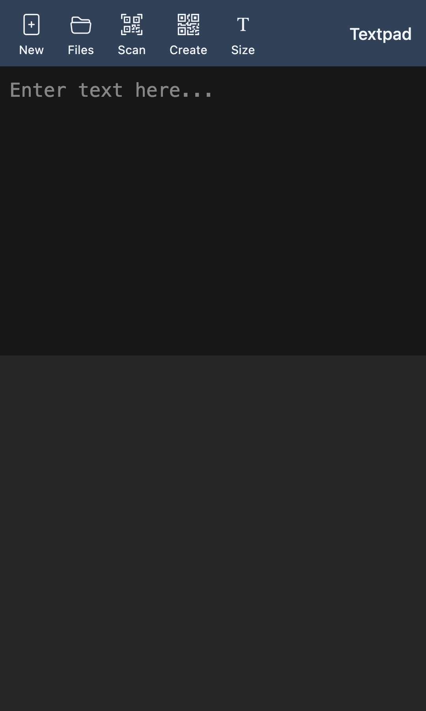

# Textpad Web


A simple text input web app designed for mobile use, useful for checking kanji conversion and more.



Works as a PWA — add it to your iPhone home screen to use it as a lightweight app.

## Features

- Text input (fullscreen textarea)
- Auto-save to local storage (after 1 second)
- Multiple file management
- QR code scanning (using camera)
- QR code generation

## Tech Stack

- SvelteKit 2 + Svelte 5 (runes)
- Tailwind CSS 4
- TypeScript
- adapter-static (SSG)
- svelte-sonner (toast notifications)
- jsqr / qrcode (QR code processing)
- Bootstrap Icons

## Development

```bash
# Install dependencies
pnpm install

# Start dev server
pnpm dev

# Type check
pnpm check

# Build
pnpm build

# Preview build output
pnpm preview
```

## Deployment

Deployed to Vercel. Pushing to GitHub triggers an automatic build.

Configuration files:
- `svelte.config.js`: adapter-static settings
- `vercel.json`: Build command and output directory
- `src/routes/+layout.ts`: Prerender enabled

## Project Structure

```
src/
  routes/
    +page.svelte       # Main text input page
    +layout.svelte     # Layout (Toaster)
    +layout.ts         # Prerender config
    files/+page.svelte # File list
    qr-scan/+page.svelte  # QR code scanner
    qr-create/+page.svelte # QR code generator
  lib/
    stores/
      textpad.svelte.ts # File management store (Svelte 5 runes)
  service-worker.ts    # Service worker for PWA
static/
  manifest.json        # PWA manifest
  icon-192.png         # App icon
  icon-512.png         # App icon (large)
```
